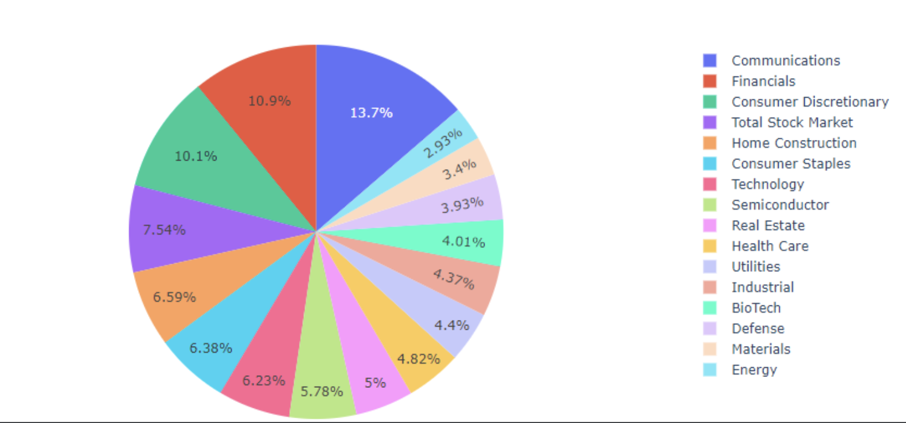
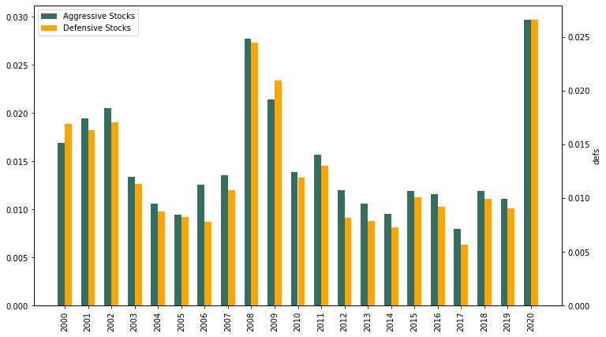

# FinTech BootCamp Project_1

## *Scott, Jatinder, Jason*
---

### We are looking at the impact on the US economy when a natural disaster hits. Comparing the effect on individual sectors when the GDP jumps up or down over 2.5% to normal standard deviation since 2000.

***" When is the right time to buy? "***

Show graph during this point and highlight the bar graphs and explain  "jumps" and show what the total market did from 2000 - 2020.

See if anyone will pick out what events caused the dips in the economy and discuss what happened during those drops.

## **Sectors and Disasters**

### In this section we looked at when the GDP jumped above or below 2.5% (*world_bank*). We were trying to understand what sectors of the market were hit during those major events, and then find out if there were any patterns to which sectors had the fastest recovery.

- IN THIS GRAPH WE COMPARED THE JUMPS AGAINST EACH OF THE SECTORS TO SEE IF ANY INDUSTRY HAS CONSISTENTLY HIGHER VOLITILATY THEN THE REST. 

 - BUBBLE GRAPH THAT SHOWS EACH SECTOR AND THE NUMBER OF TIMES IT JUMPS OVER 2.5%

- DEFENSIVE VS AGGRESSIVE SECTORS
- What do you notice about the graph? (only 2x did the defensive beat the aggressive sectors)

## **What sectors do you think had the best recorvery???**

### - The graph below shows the Defensive and Aggressive sectors compared to the total stock market as well as the number of people who were considered affected by the disaster along with a line for total deaths.  

### - Based on this preliminary analysis your best bet would have been to invest in aggressive sectors for slightly higher returns.

### - As an overall conclusion we found that despite what common knowledge might say. It is best to invest in the market right after a crash because in each case when a disaster event occured the market was quick to recover and buying at the low point would give you the best opportunity to make higher returns. 