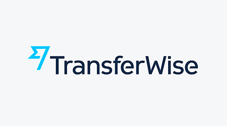
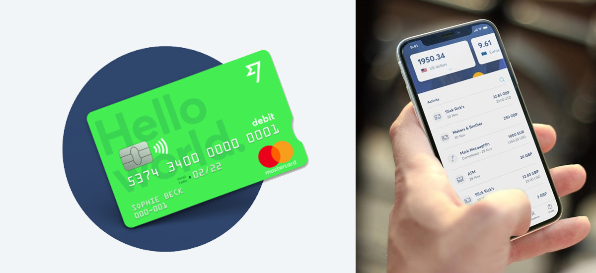

# hw_folder - Homework 1

##  due Saturday, 4/25 by midnight. 
---

***"Money without Boarders"***

## **Overview:**
    
Just a decade ago, Kristo Kaarmann & Taavet Hinrikus founded Transferwise in 2011. Kristo was quoted saying the idea came to him shortly after he recieved his Christmas bonus back in 2008.

Working in London, he was paid in Pounds, but had a mortage back in Estonia that needed to be paid in Euros.

When he went to transfer some of his Christmas bonus into his bank account tied to his  Estonia apartment, he noticed that 500 euros were missing. Due to the inflated exchange conversion rate associated with bank fees, he realized he had just donated 500 Euro just to pay his rent. The idea hit him. 

Today, Transferwise acts as an online account for more than 5 million users. Allowing them to send money back and forth internationally at a fraction of the fees that banks charge!

 

## **Funding:** 

Over the course of the next 10 years, the company's value has more than doubled, with total funding reaching $689 million going into 2018, making Transferwise the most valueable FinTech startup in Europe. (Forbes.com - May 2019) 

* Transferwise has recently been valued at **$3.5 billion** backed by Peter Theil has just finished their third year in a row with profit! 

### *Investors worth mentioning...*

Existing:

1. Andreessen Horowitz 
2. Ballie Gifford 
3. BlackRock
4. Richard Branson

Recent Investors:

1. Lead Edge Capital 
2. Lone Pine Capital 
3. Vitruvian Partners
4. Max Levchin (*PayPal - cofounder*)

## **Current Landscape:**

## *Domain:* 

 *The world of digital payments is exploding right now. With everyone racing to provide the best experience for their customers. The goal, to make the exchange of currency faster and easier. One company who stands out in this category is Transferwise. They are considered a startup FinTech company, that plays in the **Personal Finance** category with a focus in digital payments. However, the company is beginning to branch into business money transfers as well.*

### Major Competitors:

1. Currencycloud
2. Revolut
3. PayPal
4. Xoom Corp
5. Western Union

## *Industry Trends & Innovations:*

* Secure contactless transactions 
* Biometric payments, cryptography
* Payment Transparency 
* NFC technology, mPOS terminals and mobile wallets.

    .
## **Business Activity:**

Transferwise has a company objective to make the exchange of currency between countries as easy and as painless as possible. Their aim is to reduce the foreign transaction fees while providing complete transparency. 

They target international travelers, students studying abroad, freelance workers, small businesses and the average employee who works in a resturant in Italy but lives across the border in Germany and needs to pay his rent.

Using Transferwise compared to a traditional currency exchange (WesternUnion) or a bank is that you can send your money converted and into the hands of the recipient within 24 hours, against the standard of 3-7 business days. 

The way they are able to complete this transaction so much quicker is by using 2 local transfers compared to international transfers that banks use. (Telegraph.co.uk - Aug 2018) 

**One of Transferwise's largest investors, Nimay Mehta, general partner at Lead Edge Capital,** 

...said in a statement from 2018: 
"The world is moving towards a more transparent way of doing business and we want to be part of that. International money transfers represent a multi-trillion-dollar market, until now dominated by banks keeping prices artificially high and transfer times slow. TransferWise has changed all that."

***They now support over 750 Currencies compared to their competitor, Revolut, which supports only 150.***

### Why Transferwise?

Key differentiators start with their smart system: which allows for money to move across borders at the currency conversion using the real mid-market exchange rate that you would find on Reuters or Google. And second is that TransferWise has also built a borderless cash account. A multi-currency account, that lets you hold over 40 currencies to send and spend money overseas easily using their contactless TransferWise debit Mastercard (Telegraph.co.uk -AUG. 2018).

According to Stackshare, Transferwise ranks the highest in...
1. Best Exchange Rates
2. Fastest money transfers
3. Best API Support

Safety is crutial factor when it comes to international currency exchange. Many people feel comfortable with banks, trusting them to be the secure method when in reality, TransferWise is fully regulated by the Financial Conduct Authority, and just like large banks and financial institutions, the company verifies its users to protect against fraud and money laundering.

## Technologies 

Below is a list of integrated technology platforms and only a handful of the software integrations that Transferwise uses today to succeed in the market:
- Shopify
- Zapier
- Chargebee
- Pendo
- Elevio
- Solidus
- Talkable

*(source: Stackshare.com)*

## Money *$$$*

TransferWise recorded a net profit of $7.9 million (£6.2 million) for the fiscal year ending March 2018, revenues almost doubled to $148 million (£117 million).

According to the latest earnings report from September, 2019 (CNBC.com), the company's net profit climbed to 10.3 million Euros, up 66% from the previous year. 

TransferWise continues to be one of the most valuable fintech firms in Europe, holding onto positive balance sheets while their london rivals Revolute, reported losses of about £14.8 million and Monzo's losses reached 47 million last year.

The company has 6 million users worldwide and is processing over $5 billion money orders every month. The company, claims it saves customers £1 billion every year in banking fees.

The rise of FinTech companies like TransferWise will no doubt be sending panic into the minds of executives at companies like Western Union, as well as large banks around the world.

## **RECOMMENDATIONS:**

* WHAT PRODUCTS OR SERVICES WOULD YOU SUGGEST THEY OFFER TO IMPROVE?
* WHY DO YOU THINK OFFERING THIS WOULD BENEFIT THE COMPANY?
* WHAT TECHNOLOGIES WOULD THIS ADDITIONAL PRODUCT UTILIZE?
* WHY ARE THEY TECHNOLOGIES APPROPRIATE FOR THE SOLUTION?

---

Currencycloud 
- Partnered with Swift to track customer payments. 

Revolut  
- idenifies close by ATMs for exchange
- offers rewards, cryptocurrency transfers
- monthly subscription for added perks...

FUNDING:
It means Revolut’s valuation has seen a threefold increase from when it was last valued by investors at $1.7 billion in April 2018. With an extra $500 million in the bank, the latest round takes Revolut’s total amount raised up to $836 million.

He added that it was “striving towards profitability,” something that will be closely watched by investors after the company’s losses doubled in 2018 to £32.8 million ($42.4 million). It’s hoping a focus on subscription-based accounts, where users pay a monthly fee for additional perks, can help boost its bottom line