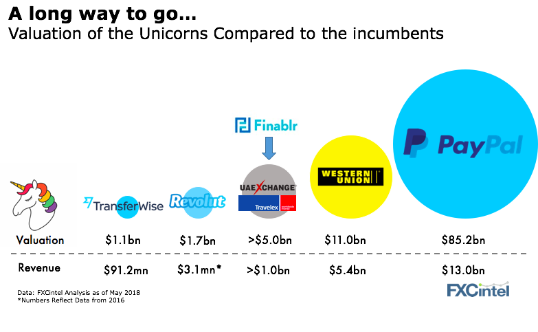

# FinTech - Homework 1

#  *Scott Andersen* 
---

***"Money without Boarders"***

## **Overview:**
    
Just a eleven years ago two guys from Estonia started a company. Kristo Kaarmann & Taavet Hinrikus founded the company Transferwise, with a goal to improve the way money is transfered between people internationally. When asked about where he got the idea for the company, Kristo was quoted as saying the idea came "shortly after he recieved his Christmas bonus, in late 2008." (*NBC*)

Working in London, he was paid in pounds, but had a mortage back in Estonia that needed to be paid in Euros.

When he went to transfer some of his Christmas bonus into the bank account in Estonia, he noticed an extra £500 was missing. Due to the inflated exchange conversion rate associated with bank and other fees, he realized he had just lost 500 Euro. With the thought of.. would it have been cheaper to fly? It was that event which started his journey for a solution. 

Today, Transferwise acts as an online account for more than 5 million users. Allowing them to send money back and forth internationally at a fraction of the fees that banks charge!

## **Up to Speed:** 

Over the course of the next 10 years, the company's value has more than doubled, with total funding reaching $689 million, making Transferwise the most valueable FinTech startup in Europe at the end of 2018. (Forbes.com - May 2019) 

* Transferwise has recently been valued at **$3.5 billion** and is largely backed by a mix of long term investors and a couple recent investors. The company just finished their third consecutive year with profit! 

### *Investors worth mentioning...*

Existing:

1. Andreessen Horowitz 
2. Ballie Gifford 
3. BlackRock
4. Richard Branson
5. Peter Theil

Recent Investors:

1. Lead Edge Capital 
2. Lone Pine Capital 
3. Vitruvian Partners
4. Max Levchin (*PayPal - cofounder*)

(*Forbes*)

## **Current Landscape:**

## *Domain:* 

 *The world of digital payments is exploding right now. With everyone racing to provide the best experience for their customers. The goal, to make the exchange of currency faster and easier. One company who stands out in this category is Transferwise. They are considered a startup FinTech company, that plays in the **Personal Finance** category with a focus in digital payments. However, the company is beginning to branch into business money transfers as well.*

### Competition:

1. Currencycloud
2. Revolut
3. PayPal
4. Xoom Corp
5. Western Union

(*Forbes*)

## *Industry Trends & Innovations:*

Over the last decade, we've seen a huge movement towards: 
* Secure contactless transactions 
* Biometric payments, cryptography
* Payment Transparency 
* NFC technology, mPOS terminals and mobile wallets.

    .
## **Business Activity:**

Transferwise has a company objective to make the exchange of currency between countries as easy and as painless as possible. Their aim is to reduce the foreign transaction fees while providing complete transparency. 

Using Transferwise compared to a traditional currency exchange (WesternUnion) or a bank is that you can send your money converted and into the hands of the recipient within 24 hours, against the standard of 3-7 business days. 

They target international travelers, students studying abroad, freelance workers, small businesses and the average employee who works in a resturant in Italy but lives across the border in Germany and needs to pay his rent.

They are able to complete transactions much quicker by using 2 local transfers compared to international transfers that banks use. (Telegraph.co.uk - Aug 2018) 

**One of Transferwises' largest investors, Nimay Mehta, general partner at Lead Edge Capital,** 

said quote: 
"The world is moving towards a more transparent way of doing business and we want to be part of that. International money transfers represent a multi-trillion-dollar market, until now dominated by banks keeping prices artificially high and transfer times slow. TransferWise has changed all that."

***They now support over 750 Currencies compared to their competitor, Revolut, which supports only 150.***

### Why Transferwise?

Key differentiators start with their smart system: which allows for money to move across borders at the currency conversion using the real mid-market exchange rate that you would find on Reuters or Google. And second is that TransferWise has also built a borderless cash account with an above average user experience platform. A multi-currency account, that lets you hold over 40 currencies to send and spend money overseas easily using their contactless TransferWise debit Mastercard (Telegraph.co.uk -AUG. 2018).

According to Stackshare, Transferwise ranks the highest in...
1. Best Exchange Rates
2. Fastest money transfers
3. Best API Support

Safety is crutial factor when it comes to international currency exchange. Many people feel comfortable with banks, trusting them to be the secure method when in reality, TransferWise is fully regulated by the Financial Conduct Authority, and just like large banks and financial institutions, the company verifies its users to protect against fraud and money laundering.

## Technologies 

Below is a list of integrated technology platforms and only a handful of the software integrations that Transferwise uses today to succeed in the market:
- Shopify
- Zapier
- Chargebee
- Pendo
- Elevio
- Solidus
- Talkable

*(source: Stackshare.com)*

## Money *$$$*

TransferWise recorded a net profit of $7.9 million (£6.2 million) for the fiscal year ending March 2018, which almost doubled to $148 million. According to the latest earnings report from September, 2019 (CNBC.com), the company's net profit climbed to 10.3 million euro, up 66% from the previous year. 

TransferWise continues to be one of the most valuable fintech firms in Europe, holding onto positive balance sheets while their london rivals, Revolute, reported losses of about £14.8 million. 

Revolut’s valuation has seen an increase from when it was last valued by investors at $1.7 billion in April 2018. With an extra $500 million in the bank, the latest round takes Revolut’s total amount raised up to $836 million. This is interesting considering the company's losses doubled in 2018 to £32.8 million. Investors are hoping a focus on subscription-based accounts, where users pay a monthly fee for additional perks, can help boost its bottom line. Anther competitor, Monzo's, losses reached 47 million last year (CNBC.com - Article)

The company has 6 million users worldwide and is processing over $5 billion money orders every month. The company, claims it saves customers £1 billion every year in banking fees.

The rise of FinTech companies like TransferWise will no doubt be sending panic into the minds of executives at companies like Western Union, as well as large banks around the world.

## **RECOMMENDATIONS:**

I believe Transferwise has a sound buisness plan, it seems to be working with profits growing over the last 3 years. However, if I were to make a reccommendation, I would suggest they create a rewards program and try to setup text alerts for when the recipent has the money in their bank account.

People love rewards programs because it makes them feel like they're getting a little something extra when they buy from you. As a consumer, I can relate and it drives you to come back to that particular store or use that card more oftern so that you can build points. I think this could be one way Transferwise could grab additional market share. Payment companies want you to use their platform to pay. They make money based on the volume of transactions running on their system and a rewards program would incentivize purchases. 

They could also take a look at strategic partnerships with well known merchants that could allow card users to recieve bonus points or discounts on products when they use the debtcard at their store. I believe this would add to the excitment and encourage customers to use the card more oftern,at least for tourists. 

The best way to understand this company is to check out their website (Transferwise.com) and play around on their website to see how clean and intuitive it operates. I don't believe adding a rewards aspect to their buisness application will be difficult. 

## List of Sources

1. Forbes

https://www.forbes.com/sites/samshead/2019/05/22/transferwise-valued-at-35-billion-as-founders-sell-stake/#5ade5aa4375e

2. NBC

https://www.cnbc.com/2019/01/28/transferwise-kristo-kaarmann-on-what-led-up-to-the-business-idea.html

3. Innovation Enterprise

https://channels.theinnovationenterprise.com/articles/top-three-tech-trends-disrupting-the-payments-industry

4. Telegraph - Transferwise

https://www.telegraph.co.uk/money/transferwise/how-does-it-work-and-is-it-safe/

5. NBC Article - Revolut

https://www.cnbc.com/2020/02/24/fintech-firm-revolut-bags-500-million-in-funding-round-led-by-tcv.html

6. CNBC

https://www.cnbc.com/2019/09/18/transferwise-earnings-2019-fintech-firm-posts-third-year-of-profit.html

7. Stackshare

https://stackshare.io/transferwise
